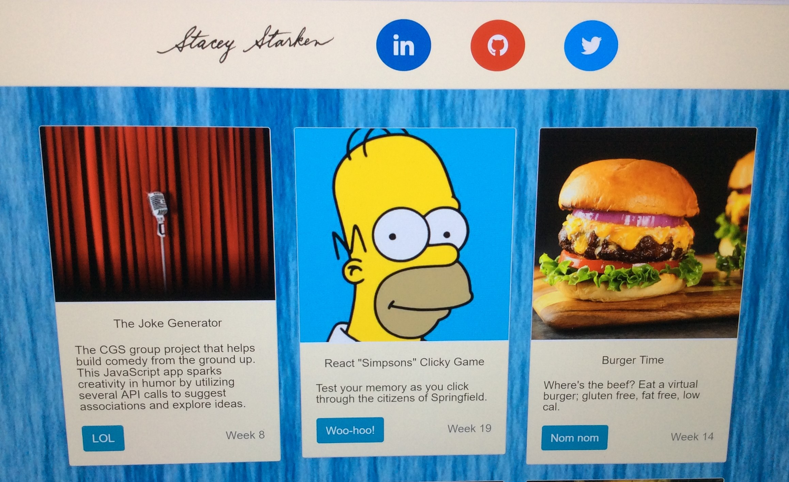

# :notebook: Stacey Starken - [Portfolio](https://tsstace.github.io/Portfolio/) :octocat:

Welcome, here is a collection of coursework completed through the University of MN Coding Bootcamp program.

Projects include such apps as:
* a JavaScript trivia game with timers
* a Node app with a storefront, aka "Bamazon"
* a full stack site that will find your new BFF - Friend Finder!
* an AJAX Giphy API that returns themed gifs
* the Node LIRI bot that knows your favorite song, movie and the best Tweets around
* a train scheduling application featuring the Firebase database
* an alphabet guessing game played with the browser
* a crystal game that challenges the user to match a goal amount
* a React clicky game featuring "The Simpsons"
* a React "New York Times" article scraper

